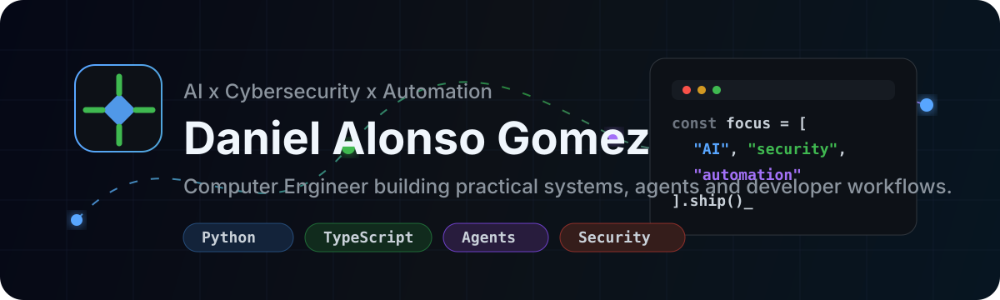

  
   
  
   
  
  
  

<h1 align="center">Hi, I'm Daniel Alonso Gomez</h1>

  Computer Engineer specializing in <strong>Artificial Intelligence</strong> and <strong>Cybersecurity</strong>, based in Spain.
  I build practical tools around AI agents, knowledge graphs, developer workflows, automation and educational software.

  
  
  

---

## Focus

<table>
  <tr>
    <td width="33%" valign="top">
      <h3>AI Systems</h3>
      
Agentic workflows, RAG-style knowledge access, repo analysis, automation loops and tools that turn context into useful action.

    </td>
    <td width="33%" valign="top">
      <h3>Cybersecurity</h3>
      
Security-aware engineering, defensive thinking, automation hygiene, scripting and practical systems work.

    </td>
    <td width="33%" valign="top">
      <h3>Product Engineering</h3>
      
Full-stack apps, educational platforms, developer experience, GitHub workflows and maintainable delivery habits.

    </td>
  </tr>
</table>

## Featured Work

  
  
  
  

## Tech Stack

  

  
  
  
  
  

## GitHub Signal

  
  
   
  
  

  

## Contribution Animation

  <picture>
    <source media="(prefers-color-scheme: dark)" srcset="https://raw.githubusercontent.com/dalonsogomez/dalonsogomez/output/github-contribution-grid-snake-dark.svg">
    <source media="(prefers-color-scheme: light)" srcset="https://raw.githubusercontent.com/dalonsogomez/dalonsogomez/output/github-contribution-grid-snake.svg">
    
  </picture>

## How I Work

<table>
  <tr>
    <td><strong>Context first</strong></td>
    <td>I prefer understanding the system, constraints and user goal before writing code.</td>
  </tr>
  <tr>
    <td><strong>Useful automation</strong></td>
    <td>I build scripts, workflows and agents when they reduce repeated work or make quality easier to verify.</td>
  </tr>
  <tr>
    <td><strong>Practical quality</strong></td>
    <td>I value clean delivery, reproducible verification and software that remains understandable after the first version.</td>
  </tr>
</table>

  

---

  <strong>Open to collaborating on AI tooling, automation, cybersecurity learning projects and developer workflows.</strong>

