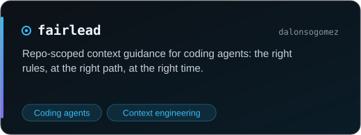

  <picture>
    <source media="(prefers-color-scheme: dark)" srcset="./assets/banner-dark.svg">
    <source media="(prefers-color-scheme: light)" srcset="./assets/banner-light.svg">
    
  </picture>

  

    
    
    
  

## About me

I'm **Dani**, a senior software engineer in Madrid. By day I work on open banking at **Tink (Visa)**; I'm also studying MLOps at **Universidad Pontificia Comillas (ICAI)**.

Most of what I build in the open is about one problem: **giving AI agents the right context**. That means persistent memory for codebases, repo-scoped guidance for coding agents, MCP servers that plug models into real tools, and ML research that is reproducible before it is impressive.

- 🧠 **Agents & context engineering**: memory, retrieval and tool access (MCP) for coding agents
- 📊 **Rigorous ML**: walk-forward evaluation, calibration and controls against backtest overfitting
- 🏦 **Production engineering**: APIs, reliability and security in a regulated fintech environment

## Featured projects

  <a href="https://github.com/dalonsogomez/braid-kg"><picture><source media="(prefers-color-scheme: dark)" srcset="./assets/card-braid-kg-dark.svg"><source media="(prefers-color-scheme: light)" srcset="./assets/card-braid-kg-light.svg"></picture></a>
  <a href="https://github.com/dalonsogomez/fairlead"><picture><source media="(prefers-color-scheme: dark)" srcset="./assets/card-fairlead-dark.svg"><source media="(prefers-color-scheme: light)" srcset="./assets/card-fairlead-light.svg"></picture></a>
  <a href="https://github.com/dalonsogomez-ai/swarmtrader"><picture><source media="(prefers-color-scheme: dark)" srcset="./assets/card-swarmtrader-dark.svg"><source media="(prefers-color-scheme: light)" srcset="./assets/card-swarmtrader-light.svg"></picture></a>
  <a href="https://github.com/dalonsogomez/vp-class-diagram-agent-afg"><picture><source media="(prefers-color-scheme: dark)" srcset="./assets/card-vp-class-diagram-agent-dark.svg"><source media="(prefers-color-scheme: light)" srcset="./assets/card-vp-class-diagram-agent-light.svg"></picture></a>

## Toolbox

  

  
  
  
  
  

## How I work

<table>
  <tr><td><strong>Context first</strong></td><td>Understand the system, its constraints and the real goal before writing code.</td></tr>
  <tr><td><strong>Evidence over vibes</strong></td><td>Tests, evaluations and reproducible runs decide whether something works.</td></tr>
  <tr><td><strong>Automate the boring parts</strong></td><td>Scripts, workflows and agents where they remove repetition, not judgment.</td></tr>
</table>

## Contribution graph

  <picture>
    <source media="(prefers-color-scheme: dark)" srcset="https://raw.githubusercontent.com/dalonsogomez/dalonsogomez/output/github-contribution-grid-snake-dark.svg">
    <source media="(prefers-color-scheme: light)" srcset="https://raw.githubusercontent.com/dalonsogomez/dalonsogomez/output/github-contribution-grid-snake.svg">
    
  </picture>

  Want to talk about AI agents, ML systems or developer tooling? <a href="https://www.linkedin.com/in/dalonsogomez">Find me on LinkedIn</a>.

